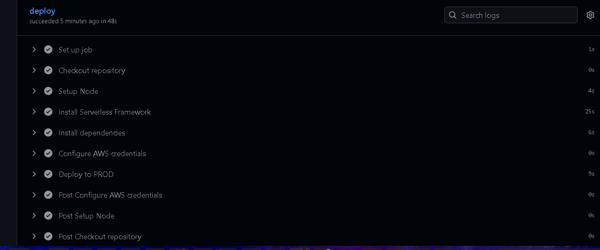

# Serverless Backend API

This is a serverless backend built with AWS Lambda, API Gateway, and DynamoDB, providing a RESTful API for CRUD operations.

## Features

- **RESTful API** with CRUD endpoints
- **Serverless Architecture** using AWS Lambda and API Gateway
- **DynamoDB** for data storage
- **ES Modules** support
- **CI/CD** with GitHub Actions
- **Environment-based** configuration

## API Endpoints

| Method | Endpoint       | Description                |
|--------|----------------|----------------------------|
| POST   | /items         | Create a new item          |
| GET    | /items         | Get all items              |
| GET    | /items/{id}    | Get a specific item        |
| PUT    | /items/{id}    | Update an existing item    |
| DELETE | /items/{id}    | Delete an item             |

## Prerequisites

- Node.js 18.x or later
- npm or yarn
- AWS Account with appropriate permissions
- Serverless Framework CLI

## Local Development

1. Install dependencies:
   ```bash
   npm install
   ```

3. Start the local development server:
   ```bash
   serverless offline
   ```

   The API will be available at `http://localhost:3000`

## Deployment

### Manual Deployment

Deploy to development:
```bash
serverless deploy
```

Deploy to production:
```bash
serverless deploy --stage prod
### CI/CD Deployment

The project includes a GitHub Actions workflow that automatically deploys the backend when changes are pushed to the `master` branch.

## Environment Variables

| Variable                | Description                     | Required | Default     |
|-------------------------|---------------------------------|----------|-------------|
| AWS_ACCESS_KEY_ID       | AWS Access Key ID               | Yes      | -           |
| AWS_SECRET_ACCESS_KEY   | AWS Secret Access Key           | Yes      | -           |
| AWS_REGION              | AWS Region                      | No       | us-east-1   |
| STAGE                   | Deployment stage                | No       | dev         |
| TABLE_NAME              | DynamoDB table name             | No       | Generated   |

## Project Structure

```
backend/
├── src/
│   ├── handlers/          # Lambda function handlers
│   │   ├── create.js      # Create item handler
│   │   ├── read.js        # Read item handler
│   │   ├── update.js      # Update item handler
│   │   └── delete.js      # Delete item handler
│   └── utils/             # Utility functions
│       └── responses.js   # Standardized response helpers
├── tests/                 # Test files
├── serverless.yml         # Serverless configuration
└── package.json           # Dependencies and scripts
```

## CI/CD Pipeline

The CI/CD pipeline is configured using GitHub Actions (`.github/workflows/backend.yml`). It performs the following steps:

1. Checks out the code
2. Sets up Node.js
3. Installs Serverless Framework
4. Installs dependencies
5. Configures AWS credentials
6. Deploys to AWS


